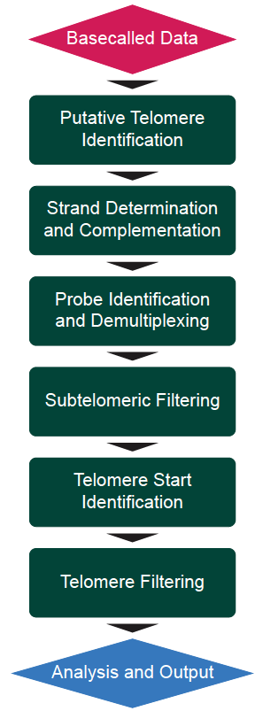

# TARPON v1.0.0
Telomere Analysis and Research Pipeline Optimized for Nanopore Sequencing Data

TARPON is no longer supported at this location. Please see https://github.com/ndeimler99/TARPON for the most updated version of TARPON
## Table of Contents
1. [What is TARPON and Why Should I Use It?](#what_and_why)
2. [The Pipeline](#pipeline)
3. [Installation](#installation)
4. [Running Tarpon Through Epi2Me](#epi2me)
5. [Running Tarpon Through the Command Line](#commandline)
6. [Additional Help and Information](#help)
7. [Input Paramaters](#input)
8. [Advanced Input Parameteres](#advanced_input)
9. [Output Files](#output)

If you use this software please cite...

## [What is TARPON and Why Should I Use It?](#what_and_why)

TARPON is a pipeline developed in the lab of Dr. Peter Baumann by PhD candidate Nathaniel Deimler. At the time of the pipeline's creation there were multiple publications (Karimian et al., 2024; Sanchez et al., 2024; Schmidt et al., 2024) that have developed protocols for the enrichment of telomeric sequences to succesfully sequence human telomeres by Nanopore sequencing while remaining cost productive. Unfortunately, these papers use different methods to identify and process telomeric reads. TARPON is the first fully automated and GUI-accessible telomere analysis pipeline tailored to nanopore sequencing. It supports both splint- and duplex-enriched telomeric libraries and is designed for ease of use with experimentally validated defaults and seamless integration into the EPI2ME platform. No command-line experience or manual data manipulation is required for standard operation. At the same time, TARPON offers advanced users full flexibility to adjust parameters for specialized research questions, including non-human samples and atypical telomeric features. For more information please see ....

## [The Pipeline](#pipeline)

TARPON begins by identifying a set of putative telomeric sequences to reduce computational time and resources at later steps in the pipeline. By default, this is done by isolating reads that contain at least ten perfect telomeric repeats (see parameters: repeat, repeat_count). These repeats do not have to be consecutive.  The ratio of G telomeric repeats to C telomeric repeats is calculated for all putative telomeric reads. If the ratio falls between 20 and 80% (see parameter reverse_complement_threshold) the reads are discarded as they are most likely chimeric sequences.  All reads that are less than 20% G telomeric repeats (these would be C strand reads) are reverse complemented so all telomeric reads are in the same orientation for further analysis. Original strand information is retaiend throughout the pipeline and strands can be compared using the parameter "--strand_comparison".  Telomeric reads are then demultiplexed and the end of the read is identified using either a provided capture probe sequence (--capture_probe_sequence) or by the barcodes found in "--sample_file". If no sample_file is provided all reads are considered to end in the capture probe sequence and belong to the same sample: in this case "--sample_name" should also be provided.  In the case that all telomeric capture probes/sequences are unique and do not contain a shared sequence, "--capture_probe_sequence" should be left blank and the end of the telomeric read will be determined by the barcodes present in sample_file. If both capture probe sequence and sample_file are provided, the end of the telomere will be determined by the presence of the capture_probe_sequence and demultiplexed by the barcodes found in sample_file. In all cases of sequence searches, fuzzy searching is conducted based on "--capture_probe_sequence_errors" and "--barcode_errors". It is recomended a minimum sequence length of 12 nucleotides be used with two errors, increasing by one error for every additional 8 base pairs, assuming the sequence difference between all barcodes is greater than three. The pipeline will return an error if the hamming distance of barcodes is less than the number of allowable errors.

After demultiplexing telomeric reads are filtered to ensure the telomere was completely sequenced by removing reads containing more than 20% (--subtelo_threshold) one nucleotide telomeric repeat variants in the first 300 base pairs (--min_subtelo_length). Telomere length determination is divided into two steps. The first is the identification of the Variable Repeat Rich (VRR) Region Start, followed by telomere length calculation.  During development of the pipeline it was clearly seen in both HG002 data and data collected from clinical samples, that while there was rarely a sharp and sudden increase from 0 to 100% of perfect telomeric repeats, there was a region immediately adjacent to the telomere composed of nearly 100% one nucleotide telomere repeat variants (see Deimler et al. for more information). The beginnig of this VRR region was often a very clear and suddent increase from 0% to 100%. Computationally, this region is identified by a sliding window 100bp in size (--sliding_window_size) jumping 15bp (--sliding_window_interval) at a time. Once this window reaches a threshold of being composed of 60% (--upper_threshold) telomere+1N repeats the VRR-region starts at the first one nucleotide variant repeat sequence within the sliding window, assuming the sliding window remains above 5% (--lower_threshold) for the remainder of the read. If the sliding window drops below the lower_threshold for 15 consecutive windows (--consecutive_threshold) the VRR-region start site is not defined. These thresholds were determined by computationally comparing algorithms to a manually annotated truth set. The lower threshold is required to ensure that one nucleotide variation islands that exist within the subtelomere do not drastically skew any length estimations. Output of the pipeline includes all relevant statistics and graphics as well as a pre-compiled HTML report with all information collected.

## [Installation](#installation)

TARPON is a nextflow pipeline and is readily integrable into Epi2Me but can also be installed on the command line. Nextflow must also be installed which requires a java and docker or singularity installation.  Please see https://www.nextflow.io/docs/latest/install.html for more information on installing nextflow and java. For more information on NextFlow please see https://www.nextflow.io/docs/latest/index.html.

To install TARPON on the command line simply clone this github repository and ensure Docker or Singularity are installed on your system. Nextflow will automatically pull the appropriate docker images from dockerhub the first time the program is executed to ensure no dependency issues arise.

    git clone git@github.com:ndeimler99/TARPON.git
    chmod +x TARPON/bin/*
 
 Installation can be tested by running the following commands within the TARPON directory

    nextflow run main.nf --version
 
    
    nextflow run main.nf --help
 

    nextflow run main.nf --input ./test_data/simplex_test.duplex.bam --capture_probe_sequence ATGCTACGATCA --outdir ./simplex_test

## [Running TARPON through Epi2Me](#epi2me)

EPI2ME can be accessed and downloaded at https://epi2me.nanoporetech.com/. TARPON can be directly imported into the EPI2ME application by clicking Launch (on the left hand menu bar) > Import Workflows (top right corner dropdown) and selecting "Import from GitHub". The following URL can be added to the dialogue window pop up to download the workflow https://github.com/ndeimler99/TARPON. 

## [Running TARPON from the Command Line](#commandline)

In the simplest form TARPON can be run using the following command. "--input" can either be a fastq file, a gzipped fastq file, a bam file, or a directory containing any of the previous file types. This command assumes there is one sample present and no demultiplexing will occur.  The end of the telomere is identified by the capture probe sequence. Both G and C strands will be included in the analysis and the enrichment procedure is assumed to have been conducted with duplex enriched data.

    nextflow run main.nf --input ./test_data/simplex_test.duplex.bam --capture_probe_sequence ATGCTACGATCA --outdir ./simplex_test

If the data is enriched via a simplex enrichment protocol "--c_strand_only" must be added to the command

    nextflow run main.nf --input ./simplex_test.c_strand_only.bam --capture_probe_sequence ACTTCGTTCGGT --c_strand_only --outdir ./simplex_test_c_strand_only

To enable demultiplexing an additional sample file will have to be provided.  This execution implies that all telomeres terminate in a common capture probe sequence and then will be demultiplexed using the barcodes found in sampleFile.csv. This is the recommended method for demultiplexing based on speed however has not been thoroughly tested.

    nextflow run main.nf --input file.bam --capture_probe_sequence NNNNNNNNNN --sample_file sampleFile.csv

To demultiplex without a common barcode sequence simply omit the capture probe sequence flag. This approach has been tested.

    nextflow run main.nf --input ./test_data/demux_test.bam --c_strand_only --sample_file ./test_data/demux_test.barcodes.csv --outdir ./demux_test_c_strand_only

To override any default paramters the parameter must be specified with --parameter_name parameter_value. For example to override the run_name.

    nextflow run main.nf --input ./test_data/simplex_test.duplex.bam --capture_probe_sequence ATGCTACGATCA --outdir ./simplex_test --run_name NEW_TEST_NAME_FOR_RUN

To activate a boolean parameter such as strand comparison no value needs to be provided after the parameter name

    nextflow run main.nf --input ./test_data/simplex_test.duplex.bam --capture_probe_sequence ATGCTACGATCA --outdir ./simplex_test --strand_comparison
  
To include a restriction digest analysis use the paramter --restriction_digest_analysis with a comma separated list of cut sites. For example searching for EcoRV and EcoRI cut sites.

    nextflow run main.nf --input ./test_data/simplex_test.duplex.bam --capture_probe_sequence ATGCTACGATCA --outdir ./simplex_test --restriction_digest_analysis GATATC,GAATTC

### Using Singularity

To use singularity for managing containers instead of Docker, you can add the `-profile singularity` flag to your command:

    nextflow run main.nf -profile singularity --input ./test_data/simplex_test.duplex.bam --capture_probe_sequence ATGCTACGATCA --outdir ./simplex_test

## [Additional Help and Information](#help)

For additional help please contact Nathaniel Deimler by opening an issue on this repository or by email at ndeimler@uni-mainz.de or nathanieldeimler.research@gmail.com or visit Deimler et al., 2025 for more information. 

## [Basic Input Parameters](#input)
| Parameter      | Epi2Me Appearance |Description | Type | Default     |
| :---        |    :----:   | :----:   | :---: |       ---: |
| run_name      | Run Name |  Name of Sequencing Run for Overall Statistics and printed on html report  | String | String| Run | 
| input   | Input |  Bam File, FastQ File, compressed fastq file, or Directory from Nanopore Sequencing for Analysis. If a directory, all bam files will be merged together. If fastq files are provided or a directory containing fastq files is provided, the fastq files will first be merged together and converted to a bam file prior to analysis  | File or Directory | None |
| fast_basecalled | Fast Basecalled | TARPON allows for data basecalled using the fast models to be analysed.  If this parameter is specified telomere reads will be isolated from the sequencing dataset and rebasecalled using the specified pod5_directory using a SUP model. This is designed to reduce turn around time. As opposed to SUP basecalling the entire dataset, only relevant reads are SUP basecalled. | Boolean | False |
| pod5_dir | Pod5 Directory | Location of raw pod5 files from sequencing. Must be specified when using --fast_basecalled | Directory | None |
| sample_name | Sample Name | Either sample file or sample name must be specified. Use sample name when not demultiplexing and all reads in the input file belong to the same sample. See sample_file | String | sample | 
| capture_probe_sequence | Capture Probe Sequence | Sequence that marks the end of telomeric repeats in G strand orientation, even if c_strand_only is activated. If no capture probe sequence is provided the barcodes listed in sample file will be considered the end of the telomeric sequence. If both a sample_file and a capture probe sequence are provided, the capture probe sequence will mark the end of the telomere, while the barcodes within sample_file will be used for demultiplexing. | String| None |
| sample_file | Sample File | A comma separated values (csv) file containing two columns without headers, "sample_name,barcode_sequence". See test_data/example_sample_file.csv. See sample_name| CSV File | None |
| Repeat | Repeat | Telomeric repeat of interest composing Telomeric Sequences | String | GGTTAG|
| outdir| Output Directory | Location of where you would like the Pipeline to output results | Path | ./output |
| trace_dir | | Location for pipeline execution information including CPU usage and time | Directory | ./{outdir}/pipeline_info |

## [Advanced Input Parameteres](#advanced_input)

| Parameter      | Epi2Me Appearance |Description | Type | Default     |
| :---        |    :----:   | :----:   | :---: |       ---: |
| overwrite_outdir | Overwrite Out Directory | If the output directory you have specified already exists, delete the directory |Boolean | False |
| c_strand_only | C Strand Only | Boolean value to dictate if the data was collected in a manner at which only C strand telomeric sequences would be expected | Boolean | False |
| minimum_telo_reads_per_sample | Minimum Telo Reads Per Sample | Minimum number of telomeric reads per sample for the sample to pass filtering criteria and considered valid for drawing conclusions | Integer | 500 |
| repeat_count | Repeat Count | Number of telomeric repeats required in a read for it to be identified as putatively telomeric |  Integer | 10 |
| reverse_complement_threshold | Reverse Complement Threshold | Percentage of telomeric repeats must be greater than this value to be classified as C strand. If the percentage is less than 1 minus this value, the read is classified as C strand. Anthing greater than 1-value but less than value is removed from analysis |  Float | 0.80|
| capture_probe_sequence_errors | Capture Probe Sequence Errors | Number of Errors to allow within the capture probe Sequence. It is recomended this value is 1/8th of the sequence length. For example, a capture probe of 16 nucleotides should contain 2 errors, while a capture probe of 24 nucleotides should contain 3 | Integer | 2 |
| barcode_errors | Barcode Errors | See capture_probe_sequence_errors , but for barcodes provided in sample_file | Integer | 3 |
| capture_probe_overhang_length|Capture Probe Overhang Length|length of nucleotides corresponding to telomeric overhang on the capture probe| Integer | 18 (3 telomeric repeats) |
| min_subtelo_length | Min Subtelomere Length | Minimum length of sequence that is less than subtelo_threshold at the beginning of the read to ensure complete sequence of the telomere. Additionally, this removes reads that are less than this length | Integer | 300 |
| subtelo_threshold | Subtelomere Threshold | Proportion of read from the start to min_subtelo_length that must not be exceeded in order to consider the read to be completely sequenced through the telomere. For example a subtelo threshold of 0.3 with a min_subtelo_length of 300 indicates the first 300 nucleotides of the read are not telomeric (in G strand conformation). | Float | 0.2 |
|sliding_window_size|Sliding Window Size| To determine telomere start position the read is analyzed using a sliding window approach, this is the size of said sliding window | Integer | 100|
|sliding_window_interval|Sliding Window Interval| The Interval will not move one bp at a time, but will rather jump. This is the jumping interval of the sliding window| Integer | 15 |
|upper_threshold| Upper Threshold | When the sliding window is composed of this ratio of one nucleotide variants of the telomeric repeat, the VRR region starts assuming it does not drop below lower threshold | Float | 0.6| 
|lower_threshold| Lower Threshold|The lower threshold (see upper threshold) at which a the proportion of one nucleotide variants of the telomeric repeat must not drop below in a sliding window | Float | 0.05|
|consecutive_threshold| Consecutive Threshold | Number of jumping windows in which the ratio of one nucleotide substitutions of the telomeric repeat must be below the lower threshold for the telomere start to be considered not identified | Integer | 15 |
|telomeric_repeat_percentage| Telomeric Repeat Percentage | From VRR start to the end of the telomere (identified by the presence of capture probes or barcodes) the telomere must be composed of this percentage of one nucleotide variations of the telomeric repeat | Float | 0.7|
| pretelo_start | Pre-Telomeric Start Distance | Distance before the VRR-region start site to check for telomeric repeats | Integer | 2000 |
| pretelomeric_repeat_percentage | Pre-Telomeric Repeat Maximum Composition | Maximum percentage of telomere+1N repeats within the pretelo_start nucleotides before the VRR-region start site. | Float | 0.1 |
| minimum_telomere_length | Minimum Telomere length | Mininum number of nucleotides in telomere, otherwise the read is removed from the analysis. It is not recomended to use this parameter unless your telomere enrichment is using low quality fragmented DNA | Integer | 0 |
|strand_comparison| Strand Comparison | Results in the creation of additional statistics and plots comparing G strand telomeric repeats and C strand telomeric repeats| Boolean | False|
|indiv_read_plots|Individual Read Plots| Will create one plot for every telomeric read with percentage of telomeric repeats on the Y-axis and location within the read on the X-axis for both perfect repeats and one nucleotide variations. In addition, the start of the VRR region is denoted by a solid red, vertical line | Boolean | False|
|restriction_digest_analysis| Restriction Digest Analysis|A comma separated list of restriction enzyme cut-sites to determine the completeness of digestion of telomeric sequences| String |None|
|mutant| USE WITH CAUTION : If a telomerase RNA mutant incorporates mutant telomeric repeats into the telomere sequence, the mutant repeat of interest can be specified here to return mutant specific calculations of processivity and occurence. Note that this function is in it's preliminary development and is used for exploratory purposes only. It is highly recomended your own analysis is done on the isolated telomeric sequences for higher levels of clarity - I am more than happy to assist and program the analysis specific to your mutant of interest.  Specifying this argument also impacts all other functions of TARPON as the mutant repeat will be included as a telomeric repeat.| String | False |

## [Ouput](#output)

Various output files are produced when the pipeline is run with different parameters. In all cases, the output directory is created containing the following subdirectories.
1. pipeline_info
2. A directory for global run statistics
3. A directory per sample labeled with either --sample_name (simplex) or the sample names listed in --sample_file (multiplex)

|Directory|Contents|
|:--|:--:|
| specified output directory| Contains an HTML report with all relevant statistics and plots for easy viewing to open in your web browser, as well as a directory containing statistics and figures from the entire run, a directory per sample if multiplexed, and a directory containing nextflow relevant workflow files|
| pipeline_info | execution_trace.txt - List of processes performed during the execution of the nextflow pipeline and their system requirement execution_timeline.html - Timeline of all processes showing memory usage and duration throughout pipeline execution execution_report.html - Detailed analysis on all pipeline executation statistics and commands pipeline_dag.html - Directed Acyclic Graph of Pipeline Execution showing how all processes interact |
| RUN_STATS | Global statistics on all reads filtered or retained throughout the analysis independent of sample.  Will contain basic .txt files listing relevant statistics and a FIGURES directory showing higher resolution plots of those found in the html report |
| One Directory per Sample | Statistics on each individual sample including filtered/retained reads, as well as indiivudal read telomere length and strand information. Contains a subdirectory FIGURES containing higher resolution plots of those found in the html report |

## Additional Output Files

Specifying one of the booleans below will result in more detailed or additional results/figures being returned with little increase in computational time or cost.  The parameters are stackable and will often produce additional input when stacked. For example combining --detailed_stats with --strand_comparison will produce more information than either parameter alone.  

| Parameter | Location | Description |
| :--------:|:--:|:--:|
|--strand_comparison| <nobr>sample directory / C_G_Comparison / |An additional directory within each sample containing three pdf files with direct comparisons of telo length and read length between the C and G strands|
|<nobr>--restriction_digest_analysis | <nobr> sample directory / restriction_digest.stats.txt |Will create one additional file per sample containing the summary statistics of all reads containing each specified cut site produced by seqkit stats|
|--plot_telo_length|sample directory / FIGURES |Will produce additional files for all predescribed telomere statistics, but using telomere length instead of the vrr telo length. This compounds with --strand_comparison to produce strand specific telo length plots |
|--detailed_stats| sample directory / DETAILED_STATS / |Will produce multiple additional figures comparing telomere length to VRR length, looking at the percentage of perfect repeats within the sequencing data, looking at the quality of telomeric sequences, etc. All such files can be found in the sample directory under FIGURES/DETAILED_STATS. This compounds with both strand_comparison and plot_vrr_length to produce additional files in the C_G_Comparison directory |
